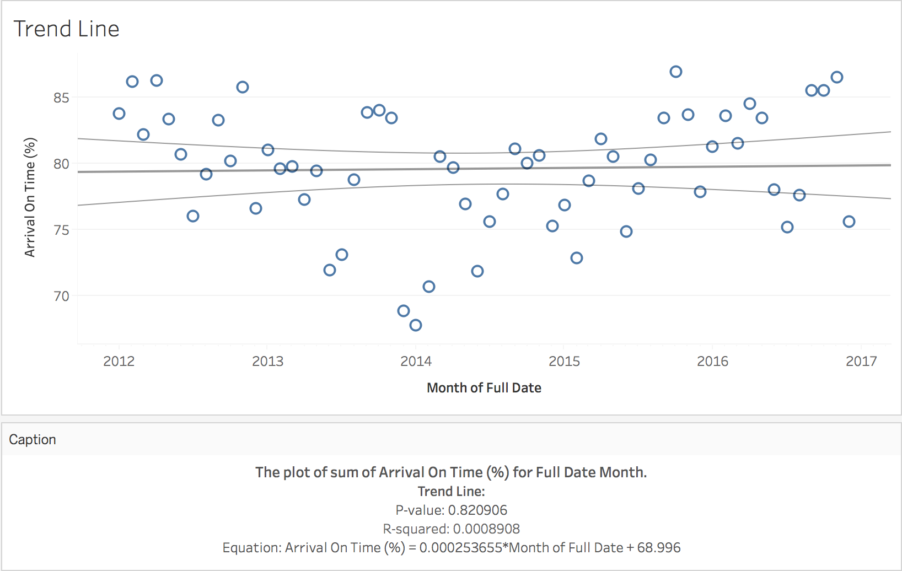

  

      <ul class="nav">
          <li><a href="mousebc_fig3.html">prev</a></li>
          <li><a href="iplotCorr.html">next</a></li>
      </ul>
  

Warndorf M, Alavid N, Hailemariam R (2018) Analysis of the percentage of on-time airline arrivals in the United States. Project was done for Marymount University's Data Analytics (MSC 325)

**Figure 1**. &mdash; The plot of sum of Arrival On-Time (%) from 01/2012 - 12/2017.
