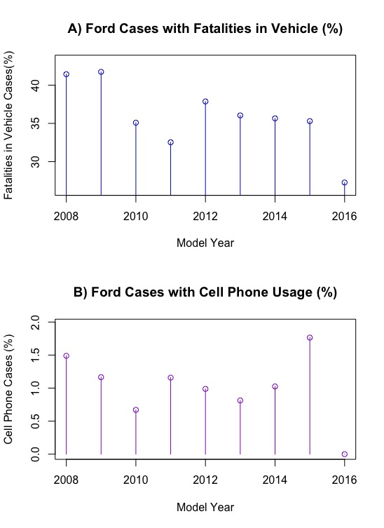

  

      <ul class="nav">
          <li><a href="transitanalysis.html">prev</a></li>
          <li><a href="airlinearrivals.html">next</a></li>
      </ul>
  

Warndorf, M (2018) Analysis conducted on the National Highway Traffic Safety Administration (NHTSA) Fatal Accident Report System (FARS) data.

**Figure 5**. &mdash; National Highway Traffic Safety Administration (NHTSA) Fatal Accident Report System (FARS) data collected nationwide between 2007 and 2015 to determine if there was a decrease in fatal car accidents involving distracted driving in relation to changes in technology, laws, and social awareness. Graph A The percentages of cases that involved a Ford vehicle and involved a fatality in the vehicle by model year. The model year data contains the percentage of cumulative data from calendar years 2007 to 2015. Graph B The percentages of cases that involved a Ford vehicle and involved cell phone usage by model year. The model year data contains the percentage of cumulative data from calendar years 2007 to 2015.
