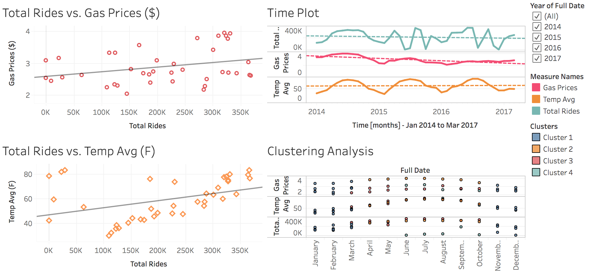

  

      <ul class="nav">
          <li><a href="airlinearrivals.html">prev</a></li>
          <li><a href="thesis.html">next</a></li>
      </ul>
  

Warndorf M, Husseini C, Almohammed M, Budnick D (2017) Washington DC Transit Data Project. Analyzed weather data, City Bikeshare data, and gas price data from Q1 2014 - Q1 2017. This project was done for Marymount University's Managing Big Data (IT 385).

**Figure 2**. &mdash; Tableau dashboard containing linear regression modules and clustering analysis done on the data (weather data, City Bikeshare data, and gas price data from Q1 2014 - Q1 2017).
